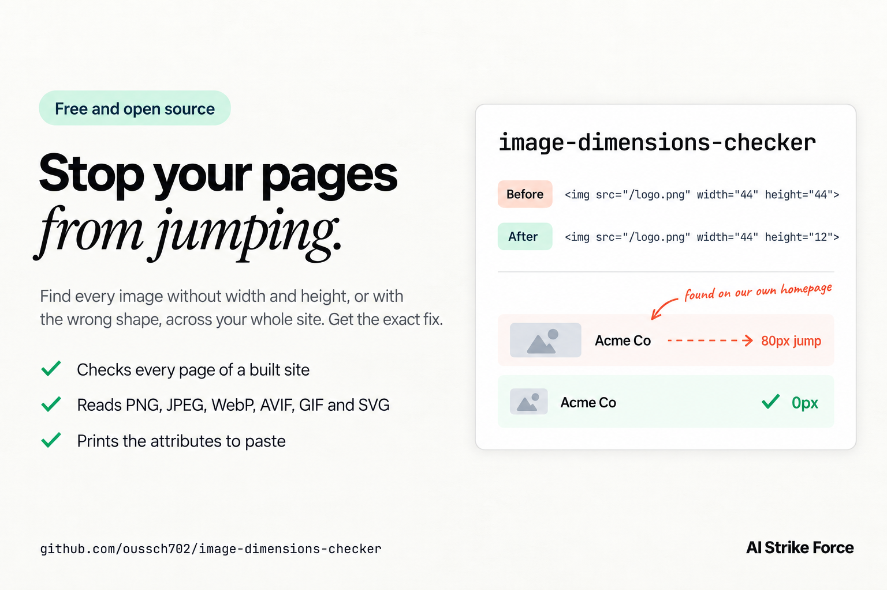

# image-dimensions-checker

[](https://github.com/oussch702/image-dimensions-checker/actions/workflows/test.yml)


[](LICENSE)



Check image dimensions across a whole site. It finds every `` without a width and height, and every image whose declared size has the wrong shape, then prints the exact attributes to fix it. The result is a page that no longer jumps while it loads.

When an `` has no `width` and `height`, the browser cannot reserve its space before the file arrives, so everything around it moves when it loads. That movement is Cumulative Layout Shift, one of Google's Core Web Vitals. A declared size with the wrong shape does the same thing more quietly: the browser reserves a box, the real image needs a different one, and the page moves anyway.

We hit both on our own site. Our [case study pages](https://aistrikeforce.com/case-studies/digital-product-funnel) show screenshots with aspect ratios from 1:1 to nearly 1:8, and a shared fallback had given every one of them the same landscape box. We fixed it with a small script that reads the real sizes from the files. This repository is that script, plus the check we wanted first: one command that lists every image to fix in a built site.

## Quick start

```bash
npx github:oussch702/image-dimensions-checker audit dist
```

Point it at the folder your build writes HTML into: `dist`, `out`, `_site`, `public` or `build`, depending on your framework.

## What it does

- **`audit`** reads the HTML of a built site and lists every `` without a width and height, and every image whose declared width and height do not match the file's shape. Each problem comes with the attributes to paste and the file and line where it appears. An image repeated on every page, like a logo in the header, is reported once.
- **`measure`** reads the real width and height of every image in a folder and writes them to JSON, JavaScript or TypeScript, for components that look sizes up at build time.

It reads PNG, JPEG, GIF, WebP, AVIF and SVG straight from the file headers, and it applies EXIF rotation the way browsers do, so a portrait phone photo is measured as portrait. It never changes your files.

## Example report

```text
image-dimensions-checker · dist · 4 pages · 8 images

Missing width or height: 2 images
  /img/team.webp  add width="1600" height="900"
    about/index.html:88
  https://cdn.example.com/cover.jpg  size unknown (remote file)
    blog/index.html:31

Declared size does not match the file: 5 images
  /img/logo.png  declared 44x44, the file is 607x160: use width="44" height="12"
    4 images on 4 pages: about/index.html:1, blog/index.html:1, index.html:1, and 1 more
  /img/shot.webp  declared 1200x800, the file is 1080x1920: use width="1200" height="2133"
    work/index.html:52

7 images need a fix.
```

When the shape is wrong, the suggestion keeps your declared width, since that is usually the size you display, and corrects the height to match the file. With CSS such as `max-width: 100%; height: auto`, the image then scales without moving anything.

The command exits with code 1 when it finds a problem, so it can fail a build in CI. Add `--warn` to report without failing.

| Option | What it does |
| --- | --- |
| `--root <dir>` | Where root-relative paths such as `/img/a.png` live. Defaults to the audited folder. Repeat it for several. |
| `--site-url <url>` | Treat absolute URLs on your own domain as local files, for example `--site-url https://example.com`. |
| `--tolerance <n>` | How far the declared shape may differ from the file before it counts. Default `0.02`, which is 2%. |
| `--ignore <text>` | Skip images whose `src` contains this text, once you have checked them by hand. Repeat it for several. |
| `--json` | Machine-readable output, one entry per image. |
| `--verbose` | List every location, and the images that could not be measured. |
| `--warn` | Report problems but exit with code 0. |

## Measure a folder of images

```bash
npx github:oussch702/image-dimensions-checker measure public --out src/image-sizes.json
```

```json
{
  "/img/logo.png": [607, 160],
  "/img/shot.webp": [1080, 1920],
  "/img/team.webp": [1600, 900]
}
```

Name the output file `.ts` or `.js`, or pass `--format ts`, to get a module that exports `IMAGE_SIZES` instead. `--prefix` changes the path prefix of the keys when your images are served from a subfolder.

## In CI

```yaml
- run: npm run build
- run: npx github:oussch702/image-dimensions-checker audit dist --site-url https://example.com
```

## What it cannot see

- **CSS.** The tool reads HTML only. A wrong shape moves the page when CSS lets the image size itself, for example with a fixed height and `width: auto`. When CSS fixes both dimensions, or the image sits in a fixed box with `object-fit`, nothing moves, although matching attributes are still correct. An inline `aspect-ratio` in the `style` attribute counts as a declared size.
- **Images added by JavaScript after the page loads.** Audit the output of a prerendered or server-rendered build.
- **Remote images.** They are listed as unknown unless they are on your own domain and you pass `--site-url`.

## FAQ

**What does "Image elements do not have explicit width and height" mean in Lighthouse?**
Lighthouse found images the browser cannot reserve space for before they load. Lighthouse checks one page at a time. This tool runs the same kind of check across every page of a built site at once, and tells you which values to add.

**My CSS already sets the image size. Do I still need width and height?**
Usually, yes. Browsers turn the two attributes into an aspect ratio before the file arrives, so an image styled with `width: 100%; height: auto` gets the right box from the first frame. Without them, that box starts at zero height.

**Which frameworks does it work with?**
Anything that writes HTML files: Astro, Eleventy, Hugo, Jekyll, Gatsby, Vite with prerendering, or a Next.js static export. Run it on the build output.

**Is it free?**
Yes. MIT licensed, with no dependencies.

## Contributing

Issues and pull requests are welcome. Run `npm test` before sending a change.

## License

MIT

---

Built by [AI Strike Force](https://aistrikeforce.com), an AI automation agency. We publish the tools that come out of building and running our own site.
